# Part 1.
### 1) адрес сети *192.167.38.54/13*
``командой ipcalc 192.167.38.54/13``
>Узнаем адрес сети :
>> 1) Адрес сети Network : 192.160.0.0/13

### 2) перевод маски *255.255.255.0* в префиксную и двоичную запись, */15* в обычную и двоичную, *11111111.11111111.11111111.11110000* в обычную и префиксную
`` командой ipcalc 255.255.255.0/15``
##### переводим в префиксную и двоичную запись

### 3) минимальный и максимальный хост в сети *12.167.38.4* при масках: */8*, *11111111.11111111.00000000.00000000*, *255.255.254.0* и */4*
`` командами ipcalc 12.167.38.4/* | grep -e HostMax -e HostMin ``
##### получаем максимальный и минимальный хости сети 12.167.38.4 :
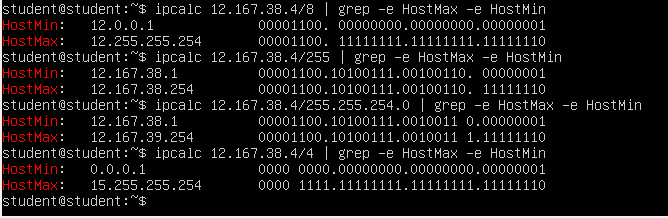

## 1.2. localhost
### Определить и записать в отчёт, можно ли обратиться к приложению, работающему на localhost, со следующими IP: *194.34.23.100*, *127.0.0.2*, *127.1.0.1*, *128.0.0.1*

1. 194.34.23.100: Этот IP-адрес является общедоступным IP-адресом в Интернете и может использоваться для связи с приложениями, работающими на удаленных серверах. При наличии соответствующих правил брандмауэра и настроек сети, вы можете обратиться к приложению, работающему на localhost, используя этот IP-адрес.

2. 127.0.0.2: IP-адрес 127.0.0.2 относится к диапазону зарезервированных IP-адресов, предназначенных для обращения к устройству, на котором они запрашиваются. Этот IP-адрес обычно не используется для общения с удаленными узлами в Интернете, поэтому попытка обращения к приложению на localhost с этим IP-адресом скорее всего не удастся.

3. 127.1.0.1: Этот IP-адрес также относится к диапазону зарезервированных IP-адресов для обращения к устройству, на котором он запрашивается. Подобно 127.0.0.2, обращение к приложению на localhost с этим IP-адресом не должно работать для удаленного доступа.

4. 128.0.0.1: Этот IP-адрес также не является частью общедоступных диапазонов IP-адресов и не может использоваться для общения с удаленными узлами в Интернете. Обращение к приложению на localhost с этим IP-адресом не будет успешным.

#### Таким образом, можно обратиться к приложению, работающему на localhost, используя IP-адрес *194.34.23.100*, но не возможно обратиться к нему с использованием IP-адресов *127.0.0.2*, *127.1.0.1* или *128.0.0.1*.

## 1.3. Диапазоны и сегменты сетей, определить и записать в отчёт:
### 1) какие из перечисленных IP можно использовать в качестве публичного, а какие только в качестве частных: *10.0.0.45*, *134.43.0.2*, *192.168.4.2*, *172.20.250.4*, *172.0.2.1*, *192.172.0.1*, *172.68.0.2*, *172.16.255.255*, *10.10.10.10*, *192.169.168.1*

1. *10.0.0.45* - Частный IP-адрес (из диапазона 10.0.0.0 - 10.255.255.255).
2. *134.43.0.2* - Публичный IP-адрес.
3. *192.168.4.2* - Частный IP-адрес (из диапазона 192.168.0.0 - 192.168.255.255).
4. *172.20.250.4* - Частный IP-адрес (из диапазона 172.16.0.0 - 172.31.255.255).
5. *172.0.2.1* - Некорректный IP-адрес (диапазон 172.0.0.0 - 172.15.255.255 зарезервирован для использования в локальных сетях).
6. *192.172.0.1* - Публичный IP-адрес.
7. *172.68.0.2* - Некорректный IP-адрес (диапазон 172.16.0.0 - 172.31.255.255 используется для частных сетей).
8. *172.16.255.255* - Частный IP-адрес (из диапазона 172.16.0.0 - 172.31.255.255).
9. *10.10.10.10* - Частный IP-адрес (из диапазона 10.0.0.0 - 10.255.255.255).
10. *192.169.168.1* - Публичный IP-адрес.

#### Таким образом, из перечисленных IP-адресов можно использовать следующие в качестве публичных: *134.43.0.2*, *192.172.0.1*, *192.169.168.1*. Остальные IP-адреса являются частными и предназначены для использования в локальных сетях.
### 2) какие из перечисленных IP адресов шлюза возможны у сети *10.10.0.0/18*: *10.0.0.1*, *10.10.0.2*, *10.10.10.10*, *10.10.100.1*, *10.10.1.255*

Для сети *10.10.0.0/18* шлюз должен находиться в той же подсети, что и устройства в этой сети. Для данной сети *10.10.0.0/18* диапазон IP-адресов будет от *10.10.0.1* до *10.10.63.254*. 

Исходя из этого, возможные шлюзы из предложенных IP-адресов для сети *10.10.0.0/18* будут:

1. *10.10.0.1* - Да, является возможным шлюзом для данной сети.
2. *10.10.0.2* - Нет, не входит в диапазон допустимых шлюзов для данной сети.
3. *10.10.10.10* - Нет, не входит в диапазон допустимых шлюзов для данной сети.
4. *10.10.100.1* - Нет, не входит в диапазон допустимых шлюзов для данной сети.
5. *10.10.1.255* - Нет, не входит в диапазон допустимых шлюзов для данной сети.
 
#### Таким образом, только IP-адрес *10.10.0.1* из предложенных может быть шлюзом для сети *10.10.0.0/18*.

# Part 2. Статическая маршрутизация между двумя машинами
## Поднять две виртуальные машины (далее -- ws1 и ws2)
### С помощью команды `ip a` посмотреть существующие сетевые интерфейсы
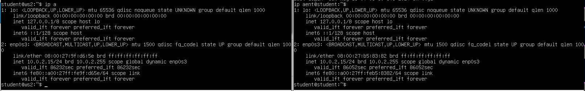
### Описать сетевой интерфейс, соответствующий внутренней сети, на обеих машинах и задать следующие адреса и маски: ws1 - *192.168.100.10*, маска */16*, ws2 - *172.24.116.8*, маска */12*
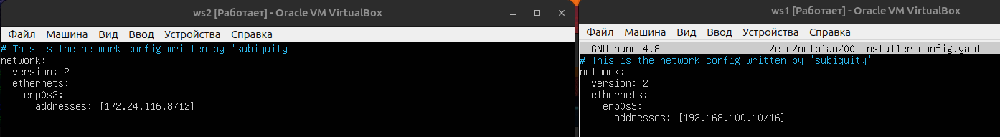
### Выполнить команду `netplan apply` для перезапуска сервиса сети
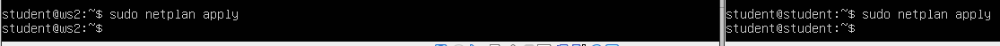
## 2.1. Добавление статического маршрута вручную
### Добавить статический маршрут от одной машины до другой и обратно при помощи команды вида `ip r add`Пропинговать соединение между машинами
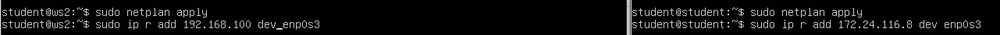
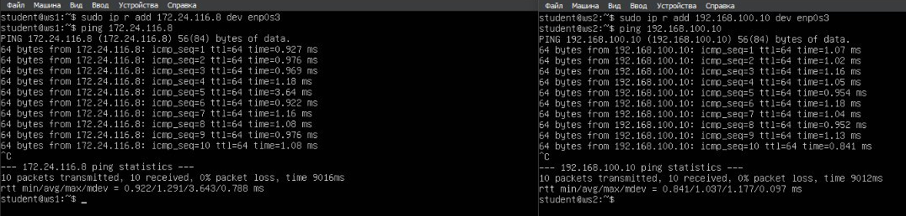

## 2.2. Добавление статического маршрута с сохранением
### Добавить статический маршрут от одной машины до другой с помощью файла *etc/netplan/00-installer-config.yaml*
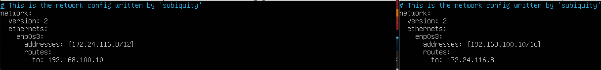
### Пропинговать соединение между машинами
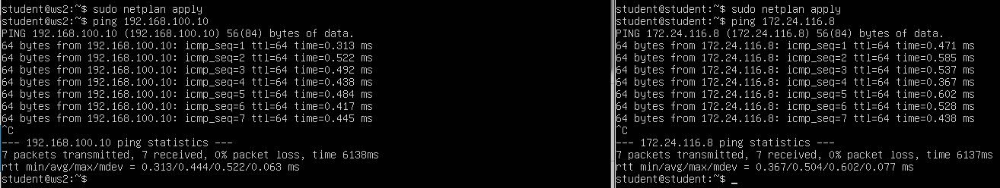

# Part 3. Утилита **iperf3**

## 3.1. Скорость соединения
### Перевести и записать в отчёт: 8 Mbps в MB/s, 100 MB/s в Kbps, 1 Gbps в Mbps

> 8 Mbps в MB/s:
- 8 Mbps = 8 мегабит в секунду
- 1 байт = 8 бит
- 1 Мбит = 0,125 МБайт
- 8 Мбит = 1 МБайт
- Таким образом, чтобы перевести мегабиты в мегабайты, нужно разделить на 8:
- 8 Mbps = 8 / 8 = 1 MB/s
> 100 MB/s в Kbps:
- 1 МБайт = 1024 Кбайт
- 1 секунда = 1 секунда
- 100 МБайт = 100 * 1024 Кбайт
- 100 * 1024 = 102400 Кбайт
- Таким образом, чтобы перевести мегабайты в килобиты, нужно умножить на 8:
- 100 MB/s = 102400 * 8 = 819200 Kbps
> 1 Gbps в Mbps:
- 1 Гбит = 1000 Мбит
- 1 Гбит/с = 1000 Мбит/с

## 3.2. Утилита **iperf3**
### Измерить скорость соединения между ws1 и ws2
- Запустим с помощью команды iperf3 -s -D серверную часть утилиты iperf3 в фоновом режиме, проверим работу сервера ss -tulpn | grep 5201. Либо iperf3 -s.
- Запустим клиентскую части утилиты iperf3 -f K, по умолчанию тестирование идет 10 сек. Либо iperf3 -c 192.168.100.10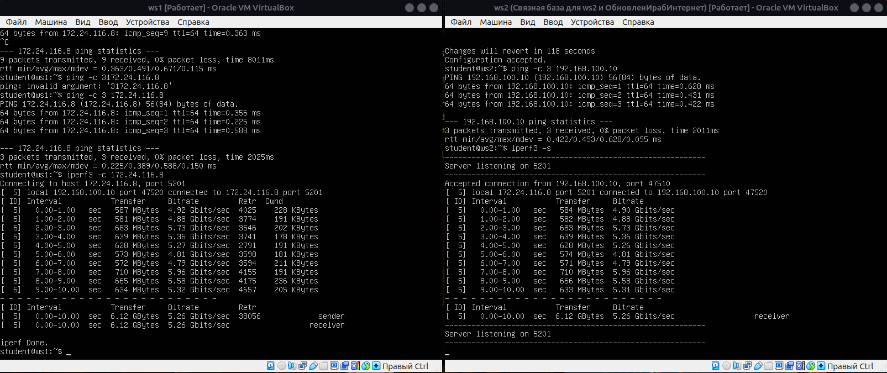
- Скрин работы клиент-серверной части ws1 ws2 с замером скорости сединения

## Part 4 Сетевой экран
Утилита iptables служит для проверки сетевых пакетов. В фильтре iptables все пакеты делятся на три основные цепочки:
input - обрабатывает входящие пакеты и подключения
forward - применяется для проходящих соединений
output - используется для исходящих пакетов и соединений а также существуют две вспомогательные:
prerouting - в эту цепочку пакет попадает перед обработкой iptables, система еще не знает куда он будет отправлен, в input, output или forward;
postrouting - сюда попадают все проходящие пакеты, которые уже прошли цепочку forward.
Для каждого типа пакетов можно установить набор правил, которые по очереди будут проверяться на соответствие с пакетом и если пакет соответствует, то применять к нему указанное в правиле действие. Правила образуют цепочку, поэтому input, output и forward называют цепочками, цепочками правил. Действий может быть несколько:

ACCEPT - разрешить прохождение пакета дальше по цепочке правил;
DROP - удалить пакет;
REJECT - отклонить пакет, отправителю будет отправлено сообщение, что пакет был отклонен;
LOG - сделать запись о пакете в лог файл;
QUEUE - отправить пакет пользовательскому приложению.
Над цепочками правил в iptables есть еще один уровень абстракции, и это таблицы. В системе есть несколько таблиц, и все они имеют стандартный набор цепочек input, forward и output. Таблицы предназначены для выполнения разных действий над пакетами, например для модификации или фильтрации.

raw - предназначена для работы с сырыми пакетами, пока они еще не прошли обработку;
mangle - предназначена для модификации пакетов;
nat - обеспечивает работу nat, если вы хотите использовать компьютер в качестве маршрутизатора;
filter - основная таблица для фильтрации пакетов, используется по умолчанию.
Создать файл /etc/firewall.sh, имитирующий фаерволл, на ws1 и ws2 и добавить в него подряд следующие правила:
-на ws1 применить стратегию когда в начале пишется запрещающее правило, а в конце пишется разрешающее правило (это касается пунктов 4 и 5)
-на ws2 применить стратегию когда в начале пишется разрешающее правило, а в конце пишется запрещающее правило (это касается пунктов 4 и 5)
открыть на машинах доступ для порта 22 (ssh) и порта 80 (http)
запретить echo reply (машина не должна "пинговаться”, т.е. должна быть блокировка на OUTPUT)
разрешить echo reply (машина должна "пинговаться")
Запустить файлы на обеих машинах командами chmod +x /etc/firewall.sh и /etc/firewall.sh
В отчёт поместить скрины с запуском обоих файлов и с содержанием файла /etc/firewall для каждой машины

Содержание файлов /etc/firewall.sh + chmod +x /etc/firewall.sh запуск /etc/firewall.sh и ping между машинами ws1 и ws2
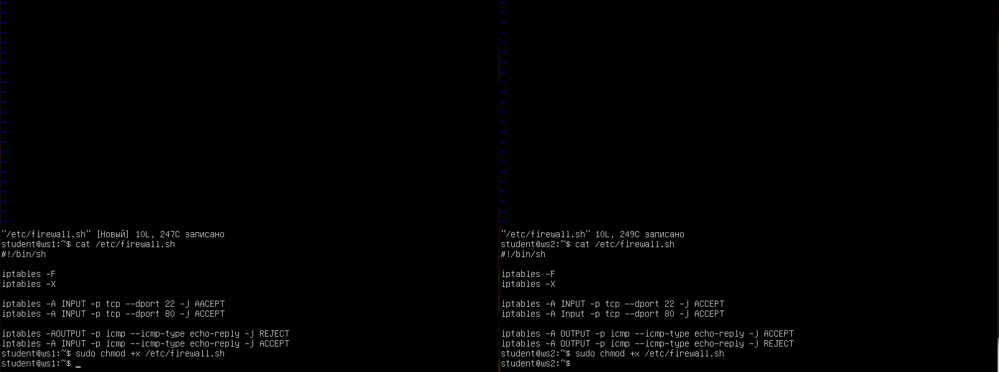
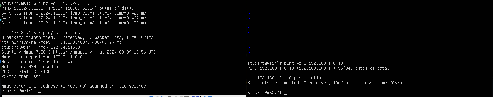
- Создание firewall.sh, запуск и ping машин друг с другом

Так как утилита iptabels выполняет первое прочитанное правило, разница между стратегиями заключается в порядке команд. Для машины ws1 первой стоит команда REJECT - отклонить пакет. Будет выполнятся этот запрет и пинг не пройдет. Для машины ws2 напротив, первым стоит ACCEPT - разрешить прохождение пакета. Пинг проходит.

## Part 4.2 nmap

Командой ping найдём машину, которая не "пингуется", после чего утилитой nmap посмотрим, что хост машины запущен

- Пингуем ws1 и ws2. На ws2 пинг не проходит, выполняем nmap для ws2

Сохраним дампы образов виртуальных машин    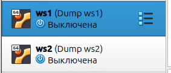
- Снимки машин ws1 и ws2

## Part 5 Статическая маршрутизация сети

  - 5.1 Настройка адресов машин
  - 5.2 Включение переадресации IP-адресов
  - 5.3 Установка маршрута по-умолчанию
  - 5.4 Добавление статических маршрутов
  - 5.5 Построение списка маршрутизаторов
  - 5.6 Использование протокола ICMP при маршрутизации

### 5.1 Настройка адресов машин

Настроим конфигурации машин в etc/netplan/00-installer-config.yaml согласно сети на рисунке.
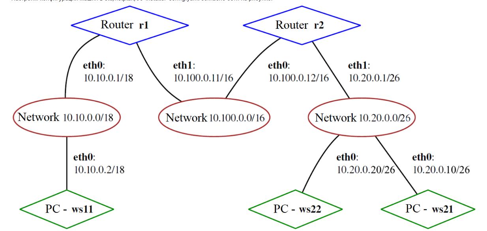
